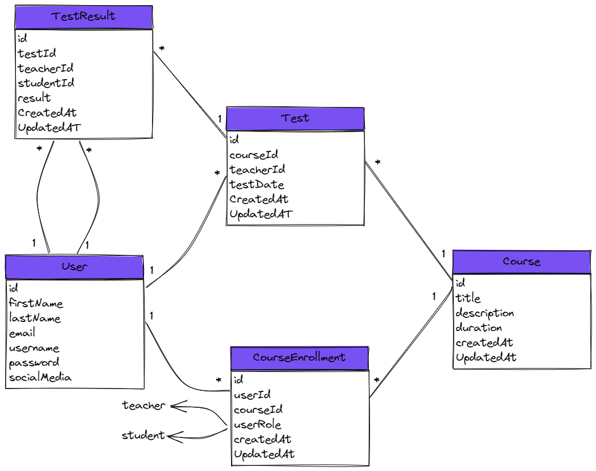

# online-courses-grading-system
## `The System's Domain`
➜ system has two types of users, the student and the teacher.  
➜ user can be both, teacher on some courses, and student who enrolled into other courses.  
➜ student can enroll into one or more courses.  
➜ teacher can teach one or more courses.  
➜ course can have one or many students.  
➜ course can be teached by only one teacher.  
➜ course has one or more tests.  
➜ test has one or more test results.  

## `The ERD`
